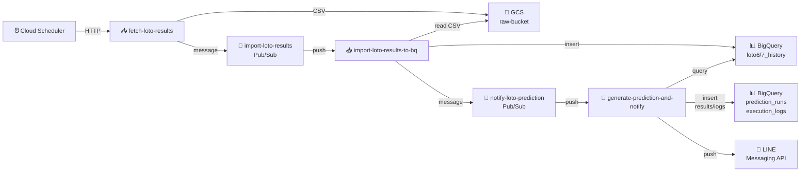
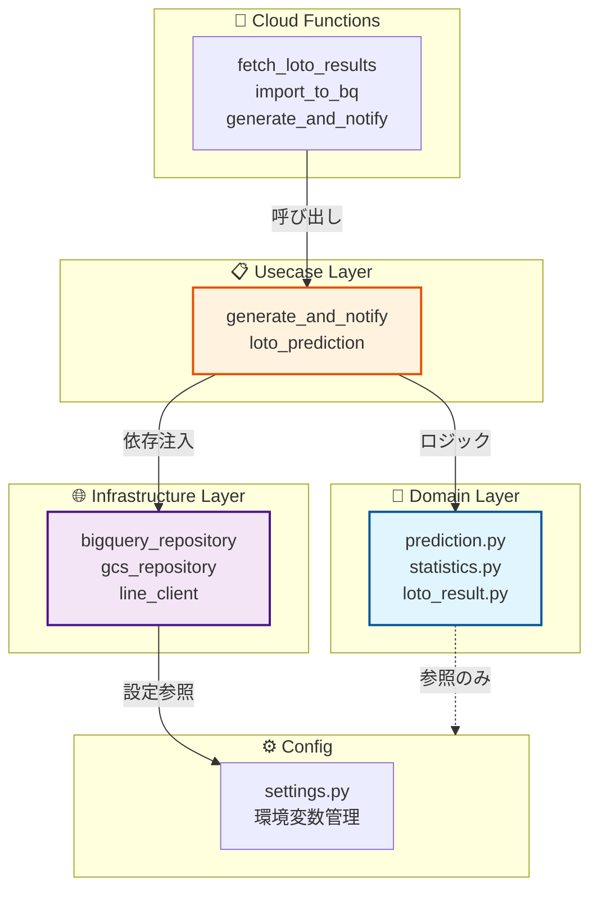
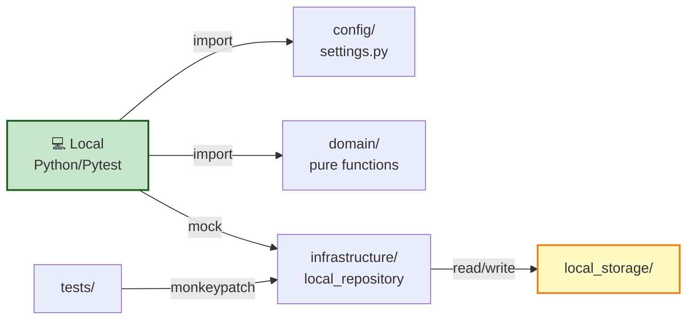
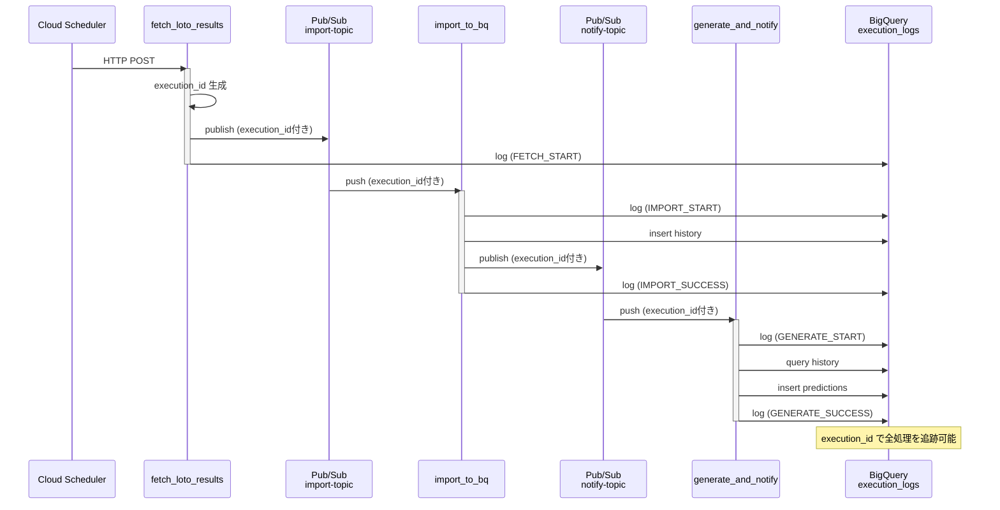

# loto-predict

GCP ベースの **ロト6・ロト7 予想番号生成 & LINE 通知システム** です。
過去当せん番号データを取得し、BigQuery に蓄積し、統計ベースで予想番号を生成して LINE に通知します。

---

## 概要

このシステムは、以下の流れで動作します。

```text
Cloud Scheduler
  ↓
fetch_loto_results
  ↓
Pub/Sub
  ↓
import_loto_results_to_bq
  ↓
Pub/Sub
  ↓
generate_prediction_and_notify
```

### 処理の流れ

1. **Cloud Scheduler が抽選日夜に `fetch_loto_results` を起動**
   - 毎週月曜・木曜（LOTO6）は 21:00 JST に HTTP POST を送信
   - 毎週金曜（LOTO7）は 21:00 JST に HTTP POST を送信
   - 理由：結果発表は抽選日20:30頃のため、公式サイト更新を確実に待つため

2. **`fetch_loto_results` が公式ページから最新当せん結果を取得**
   - Rakuten ロト公式の `/backnumber/` ページを BeautifulSoup でスクレイピング
   - 既存の draw_no と重複がないか確認（重複時はスキップ）
   - execution_id を UUID で生成（fetch・import・generate を同じ単位で追跡）

3. **取得結果を CSV 化して GCS に保存**
   - CSV フォーマット： `draw_no,draw_date,n1,n2,...,n6/n7,b1,b2,source_url`
   - パス： `gs://loto-predict-raw/loto6/draw_date=YYYY-MM-DD/draw_no=XXXX/result.csv`
   - タイムスタンプと draw_no でユニーク性を確保

4. **GCS キーを Pub/Sub メッセージとして publish**
   - メッセージペイロード例：
     ```json
     {
       "event_type": "FETCH_COMPLETED",
       "execution_id": "uuid",
       "lottery_type": "LOTO6",
       "gcs_bucket": "loto-predict-raw",
       "gcs_object": "loto6/.../result.csv",
       "draw_no": 1234,
       "draw_date": "2026-05-01"
     }
     ```
   - 非同期処理なので import 処理を即座に トリガー可能

5. **`import_loto_results_to_bq` が Pub/Sub 経由で起動**
   - Pub/Sub push subscription により自動起動
   - メッセージ受信時のリトライ上限は Google Cloud の設定に従う

6. **CSV を BigQuery に取り込み**
   - GCS から CSV を読み込み、行ごとにパース
   - draw_no で重複チェック（既存行を UPDATE ではなく INSERT をスキップ）
   - batch insert で効率化（1回のクエリで複数行挿入）
   - 取込先： `loto6_history` または `loto7_history` テーブル

7. **取り込み完了メッセージを Pub/Sub に publish**
   - 同じ execution_id、draw_no を含めて通知トピックに送信
   - 予想生成の起動トリガーとなる

8. **`generate_prediction_and_notify` が Pub/Sub 経由で起動**
   - import 完了メッセージを受け取り自動起動

9. **BigQuery の履歴データから予想番号を生成**
   - 履歴テーブルから最新N件（HISTORY_LIMIT）を降順で取得
   - `statistics.py` で各番号の出現頻度を集計 → スコアに変換
   - `prediction.py` で重み付きランダム抽選により PREDICTION_COUNT 口を生成
   - 口内の番号ソート： スコア降順、同点なら番号昇順

10. **LINE に Push 通知**
    - 予想結果を整形してメッセージを組み立て
    - LINE Messaging API の push message を送信
    - 本番環境（GCP）のみ実際に送信、ローカルは dry-run（ログ出力のみ）

11. **各処理結果を `execution_logs` に記録**
    - fetch / import / generate の各ステージで SUCCESS or FAILED を記録
    - エラー発生時は error_detail に例外メッセージを保存
    - execution_id で全処理を一元追跡可能 → トラブルシューティング時に有用

---

## 実装整合ガイド（2026-04）

以下は現行実装に合わせた運用上の正しい前提です。

### 各コンポーネントの責務

- **`fetch_loto_results` (Cloud Functions Gen2)**
  - 役割：取得フェーズの入口
  - 最新当せん結果取得
    - Rakuten ロト公式の `/backnumber/` をスクレイピング
    - BeautifulSoup で HTML を解析して抽選番号と数値を抽出
  - CSV正規化
    - 取得データを標準フォーマットに変換（draw_no, draw_date, n1-n6/n7, b1, b2 等）
  - GCS保存
    - 日時・draw_no を含むパスに CSV を保存（重複防止）
  - importトピック publish
    - 取込処理を非同期トリガー
    - `execution_id`, `lottery_type`, `gcs_uri`, `draw_no`, `draw_date` を含む

- **`import_loto_results_to_bq` (Cloud Functions Gen2)**
  - 役割：取込フェーズの処理
  - GCS CSV読込
    - fetch で保存した CSV をストレージから読み込み
  - CSV行パース
    - 各行を辞書型に変換（validation も実施）
  - draw_no 重複除外
    - BigQuery の既存レコードと照合
    - 重複時は INSERT をスキップ（冪等性確保）
  - BigQuery投入
    - batch insert で複数行を効率的に挿入
    - スキーマは infra/schemas/ で定義
  - notifyトピック publish
    - 予想生成処理をトリガー
    - 同じ execution_id を保持して追跡可能に

- **`generate_prediction_and_notify` (Cloud Functions Gen2)**
  - 役割：予想生成＆通知フェーズの入口
  - Pub/Subデコード・入力検証
    - Pub/Sub メッセージを JSON デコード
    - 必須フィールド（execution_id, lottery_type など）をチェック
  - repository / LINE client 生成
    - 環境（local or gcp）に応じた実装を動的に選択
    - local: LocalLotoRepository（local_storage 使用）
    - gcp: BigQueryLotoRepository（BigQuery 使用）
  - UseCase呼び出し
    - GenerateAndNotifyUseCase のメソッドを実行

- **`GenerateAndNotifyUseCase` (src/usecases/)**
  - 役割：ビジネスロジック集約（ドメイン・インフラ中立）
  - 履歴取得（最新順）
    - repository から最新 N 件（HISTORY_LIMIT）を降順で取得
    - draw_no, draw_date, n1-n7, b1-b2 を取得
  - 予想生成
    - domain/statistics.py で出現頻度スコアを計算
    - domain/prediction.py で重み付きランダム抽選を実行
    - 指定口数（PREDICTION_COUNT）分の組合せを生成
  - メッセージ組み立て
    - 予想結果を LINE 送信用フォーマットに整形
    - 回号（draw_no）、抽選日、予想番号を表示
  - LINE送信（localはdry-run）
    - 本番：LINE Messaging API で実際に送信
    - ローカル：ログ出力のみ（NoopLineClient 使用）
  - 実行記録保存
    - prediction_runs と execution_logs に記録
    - 監査・トラブルシューティング用

### 必須環境変数

最低限、次を設定してください（`src/config/settings.py` で一元管理）。

- `APP_ENV` (`local` or `gcp`) - 環境識別
- `GCP_PROJECT_ID` - GCP プロジェクト ID
- `GCP_REGION` - リージョン（asia-northeast1 推奨）
- `BQ_DATASET` - BigQuery Dataset 名
- `GCS_BUCKET_RAW` - raw CSV 保存先 bucket
- `PUBSUB_IMPORT_TOPIC` - import トリガートピック名
- `PUBSUB_NOTIFY_TOPIC` - notify トリガートピック名
- `HISTORY_LIMIT_LOTO6` - LOTO6 の参照履歴件数（例：100）
- `HISTORY_LIMIT_LOTO7` - LOTO7 の参照履歴件数（例：150）
- `PREDICTION_COUNT` - 生成口数（例：5）
- `LINE_CHANNEL_ACCESS_TOKEN` - LINE API access token（gcpのみ必須）
- `LINE_USER_ID` - LINE ユーザー ID（gcpのみ必須）

`BQ_DATASET` が標準です。`BIGQUERY_DATASET` は互換用途としてのみ扱い、運用設定は `BQ_DATASET` に統一してください。

`APP_ENV=local` の場合は、`LINE_CHANNEL_ACCESS_TOKEN` と `LINE_USER_ID` は未設定でも実行できます。
このとき通知は `NoopLineClient` により dry-run で処理されます（ログのみ出力）。

### 予想ロジックの考え方

**背景：** 統計的に頻出番号ほど抽選される確率が高いという仮説に基づく

- **UseCase が履歴を取得**
  - `src/usecases/generate_and_notify.py` が repository から最新 N 件を取得
  - repository の実装は環境別（local / BigQuery）に分岐

- **`statistics.py` で番号ごとの出現頻度スコアを算出**
  - 各番号（1-43 for LOTO6, 1-37 for LOTO7）が何回出現したかをカウント
  - スコア = 出現回数 / 総履歴件数（正規化）

- **`prediction.py` でスコアを重みに変換して重み付きランダム抽選**
  - スコア高い番号ほど選ばれやすい
  - `random.choices()` で重複なし抽選（population から選んだ要素は削除）

- **同一実行内で同一組合せは再利用しない**
  - 生成済み組合せを set で管理
  - 同じ組合せが出現したら再抽選

- **1口内の表示順は「スコア降順・同点は番号昇順」**
  - ユーザー見やすさ重視
  - 例：[43, 35, 22, 15, 8] のように降順

- **生成要求が組合せ総数を超える場合は `ValueError` を返す**
  - LOTO6 の総組合せ数 = C(43,6) = 6,096,454
  - 組合せ数超過は異常系とみなし例外を発生

- **通知本文には回号（`draw_no`）と日本時間（`APP_TIMEZONE`）を表示**
  - `APP_TIMEZONE` = `Asia/Tokyo`（デフォルト）
  - ユーザーが予想がいつの結果に基づくかを認識できるように

### ローカル実行

```powershell
py -3.11 -m venv .venv
.\.venv\Scripts\Activate.ps1
pip install -r requirements-base.txt
pip install -r requirements-local.txt
```

`.env.local.sample` を `.env.local` として配置し、`APP_ENV=local` を設定してください。

- local の `generate_prediction_and_notify` は `NoopLineClient` を使う dry-run で動作します。
- 実LINE送信は行わず、送信内容をログ出力します。

### Backfill 実行

ローカル:

```powershell
python jobs/backfill_loto_history/main.py --lottery-type loto6 --start-date 2026-01-01 --end-date 2026-04-01 --output-path ./local_storage/backfill/loto6_20260101_20260401.csv
```

Cloud Run Job:

- `infra/backfill_job.tf` は backfill ソースからビルドされたコンテナ image を実行します。
- 必須引数 `--lottery-type --start-date --end-date --output-path` は Terraform 側で `command/args` として設定します。
- 手動実行時は `gcloud run jobs execute ... --args` で上書き可能です。

例:

```powershell
gcloud run jobs execute backfill-loto-history --region=asia-northeast1 --args="main.py,--lottery-type,loto7,--start-date,2026-01-01,--end-date,2026-04-01,--output-path,gs://<raw-bucket>/backfill/loto7_20260101_20260401.csv"
```

### 動作確認コマンド

```powershell
pytest -q
python -m compileall functions src jobs tests
```

ローカルで通知フロー確認（LINE送信はdry-run）:

```powershell
python -c "from src.usecases.loto_prediction_usecase import generate_and_notify_prediction; print(generate_and_notify_prediction('loto6'))"
```

---

## 特徴

- GCP サーバーレス構成
- Pub/Sub による疎結合な関数連携
- BigQuery による履歴管理
- `execution_id` による一連処理の追跡
- 重複インポート防止
- 重複通知防止
- `common/` による関数共通処理の集約

---

### GCP 本番環境 - データフロー図



### Layered Architecture（3層構成）



### ローカル開発環境



### execution_id による処理追跡



---

## ディレクトリ構成

```text
loto-predict/
├─ .github/
│  └─ workflows/
│     ├─ deploy-function-source.yml
│     │   └─ Cloud Functions のソースを zip 化して GCS にアップロード
│     │      （common/ を各 function に同梱する処理もここで実施）
│     │
│     └─ terraform-infra.yml
│         └─ Terraform init / plan / apply
│            （develop: plan/validate のみ、main: apply実施）
│
├─ bootstrap/
│  ├─ main.tf
│  ├─ providers.tf
│  ├─ variables.tf
│  ├─ versions.tf
│  ├─ terraform.tfvars
│  └─ README.md
│      └─ GCP プロジェクト初期化用 Terraform
│         （state bucket、Secret Manager 等の前提リソース作成）
│
├─ infra/
│  ├─ main.tf / backend.tf / providers.tf
│  ├─ apis.tf
│  │   └─ 必須 GCP APIs 有効化
│  ├─ bigquery.tf
│  │   └─ BigQuery dataset / tables 定義
│  ├─ functions.tf
│  │   └─ Cloud Functions Gen2 定義
│  ├─ pubsub.tf
│  │   └─ Pub/Sub topics / subscriptions 定義
│  ├─ scheduler.tf
│  │   └─ Cloud Scheduler ジョブ定義
│  ├─ storage.tf
│  │   └─ GCS bucket 定義
│  ├─ iam.tf
│  │   └─ IAM ロール・バインディング定義
│  ├─ schemas/
│  │  ├─ execution_logs.json
│  │  ├─ loto6_results.json
│  │  ├─ loto7_results.json
│  │  └─ prediction_runs.json
│  │      └─ BigQuery テーブルスキーマ定義
│  ├─ variables.tf
│  │   └─ 環境依存パラメータ定義
│  ├─ versions.tf
│  │   └─ Terraform / Provider バージョン固定
│  └─ README.md
│
├─ functions/
│  ├─ common/
│  │  ├─ execution_log.py
│  │  │   └─ BigQuery execution_logs 書き込み & Cloud Logging 出力
│  │  ├─ pubsub_message.py
│  │  │   └─ Pub/Sub メッセージ decode / validate / encode
│  │  └─ time_utils.py
│  │      └─ JST 時刻生成・ISO フォーマット変換
│  │
│  ├─ fetch_loto_results/
│  │  ├─ main.py
│  │  │   └─ Cloud Scheduler から HTTP 起動
│  │  │      ・公式サイトから当せん結果取得
│  │  │      ・CSV 生成
│  │  │      ・GCS 保存
│  │  │      ・Pub/Sub publish（import トリガー）
│  │  └─ requirements.txt
│  │
│  ├─ import_loto_results_to_bq/
│  │  ├─ main.py
│  │  │   └─ Pub/Sub push で起動
│  │  │      ・GCS CSV 読み込み
│  │  │      ・重複チェック（draw_no）
│  │  │      ・BigQuery に insert
│  │  │      ・Pub/Sub publish（notify トリガー）
│  │  └─ requirements.txt
│  │
│  └─ generate_prediction_and_notify/
│     ├─ main.py
│     │   └─ Pub/Sub push で起動
│     │      ・BigQuery から履歴取得
│     │      ・予想番号生成
│     │      ・prediction_runs に保存
│     │      ・LINE Push 通知
│     └─ requirements.txt
│
├─ src/
│  ├─ config/
│  │  ├─ __init__.py
│  │  ├─ settings.py
│  │  │   └─ 環境変数の集約・型チェック・デフォルト値定義
│  │  │      （HISTORY_LIMIT、PREDICTION_COUNT 等）
│  │  └─ ...
│  │
│  ├─ domain/
│  │  ├─ __init__.py
│  │  ├─ loto_result.py
│  │  │   └─ ロト当せん結果 dataclass
│  │  ├─ models.py
│  │  │   └─ ドメイン用データモデル
│  │  ├─ statistics.py
│  │  │   └─ 出現頻度計算・スコアリング（純粋関数）
│  │  ├─ prediction.py
│  │  │   └─ 予想番号生成（重み付きランダム）
│  │  └─ ...
│  │      └─ ドメインロジック（外部依存なし）
│  │
│  ├─ infrastructure/
│  │  ├─ __init__.py
│  │  ├─ bigquery_repository.py
│  │  │   └─ BigQuery へのアクセス
│  │  ├─ local_repository.py
│  │  │   └─ ローカルストレージへのアクセス（テスト用）
│  │  ├─ gcs_repository.py
│  │  │   └─ GCS へのアクセス
│  │  ├─ line_client.py
│  │  │   └─ LINE Messaging API ラッパー
│  │  └─ ...
│  │      └─ 外部サービスとの連携
│  │
│  ├─ usecases/
│  │  ├─ __init__.py
│  │  ├─ loto_prediction_usecase.py
│  │  │   └─ 予想生成フロー（リポジトリ・usecase統合）
│  │  ├─ generate_and_notify.py
│  │  │   └─ 通知フロー全体のオーケストレーション
│  │  └─ ...
│  │      └─ ビジネスロジック集約
│  │
│  └─ utils/
│     └─ ユーティリティ関数
│
├─ jobs/
│  ├─ backfill_loto_history/
│  │  ├─ main.py
│  │  │   └─ バックフィルジョブ（CLI）
│  │  │      ・Rakuten ロト公式から過去結果取得
│  │  │      ・CSV 出力
│  │  ├─ requirements.txt
│  │  └─ logs/
│  │
│  └─ backtest_loto_prediction/
│     ├─ main.py
│     │   └─ バックテストジョブ（CLI）
│     │      ・指定範囲で予想を生成
│     │      ・結果を JSON Lines で出力
│     └─ requirements.txt
│
├─ tests/
│  ├─ test_settings.py
│  ├─ test_prediction.py
│  ├─ test_statistics.py
│  ├─ test_generate_and_notify.py
│  ├─ test_bigquery_repository.py
│  ├─ test_local_repository.py
│  ├─ test_loto_csv.py
│  ├─ test_fetch_loto_results.py
│  ├─ test_import_function.py
│  ├─ test_generate_function.py
│  ├─ test_rakuten_loto.py
│  ├─ test_score_optimizer.py
│  └─ ...
│      └─ pytest によるユニット・統合テスト
│
├─ data_samples/
│  ├─ loto6_history_sample.csv
│  └─ loto7_history_sample.csv
│      └─ テスト用サンプルデータ
│
├─ docs/
│  ├─ schema.md
│  └─ ...
│      └─ ドキュメント（スキーマ仕様等）
│
├─ local_storage/
│  ├─ raw/
│  │  ├─ loto6/
│  │  └─ loto7/
│  │      └─ fetch 取得結果（CSV）
│  ├─ imported/
│  │  ├─ loto6_history.jsonl
│  │  └─ loto7_history.jsonl
│  │      └─ import 後の履歴（JSONL）
│  ├─ backfill/
│  │  └─ バックフィル結果
│  ├─ backtest/
│  │  └─ バックテスト結果
│  └─ loto6/ / loto7/
│      └─ 最新結果キャッシュ
│
├─ logs/
│  └─ ローカル実行ログ出力ディレクトリ
│
├─ dist/
│  └─ （自動生成）
│     ├─ fetch_loto_results.zip
│     ├─ import_loto_results_to_bq.zip
│     └─ generate_prediction_and_notify.zip
│         └─ Cloud Functions 用 zip パッケージ
│
├─ scripts/
│  └─ package_functions.sh
│      └─ Cloud Functions を zip 化
│
├─ requirements-base.txt
│  └─ 共通依存関係
├─ requirements-local.txt
│  └─ ローカル開発用依存関係
│
├─ .env.local.sample
│  └─ ローカル環境設定テンプレート
│
├─ README.md
│  └─ プロジェクト全体説明
│
└─ cloudrun_errors.json
   └─ GCP エラーログキャッシュ
```

---

## Cloud Functions の役割

### 1. fetch_loto_results

役割:

- Cloud Scheduler から HTTP 起動
- ロト6 / ロト7 の最新当せん結果を取得
- CSV に変換
- GCS に保存
- import 用 Pub/Sub にメッセージ送信

入力:

```json
{
  "lottery_type": "LOTO6"
}
```

出力メッセージ例:

```json
{
  "event_type": "FETCH_COMPLETED",
  "execution_id": "xxxxxxxx-xxxx-xxxx-xxxx-xxxxxxxxxxxx",
  "lottery_type": "LOTO6",
  "gcs_bucket": "your-raw-bucket",
  "gcs_object": "loto6/draw_date=2026-04-05/draw_no=1234/xxxx.csv",
  "draw_no": 1234,
  "draw_date": "2026-04-05",
  "fetched_at": "2026-04-05T19:05:00+09:00"
}
```

---

### 2. import_loto_results_to_bq

役割:

- Pub/Sub push で起動
- GCS の CSV を読み込み
- 重複チェック
- BigQuery の履歴テーブルに取り込み
- notify 用 Pub/Sub にメッセージ送信

重複防止:

- `draw_no`

---

### 3. generate_prediction_and_notify

役割:

- Pub/Sub push で起動
- BigQuery 履歴データを読み込み
- 出現頻度ベースの重み付きランダムで予想生成
- `prediction_runs` に保存
- LINE Push 通知

重複防止:

- `execution_id` 単位で同一実行を追跡

---

## execution_id とは

`execution_id` は、**1回の処理全体を識別するID** です。

この ID を使って、

- fetch
- import
- notify

のすべてを同じ単位で追跡します。

例:

```text
execution_id = 20260405-loto6-001
```

用途:

- 重複実行防止
- ログ追跡
- 障害調査

---

## BigQuery テーブル

### loto6_history

ロト6当せん履歴

主なカラム:

- `draw_no`
- `draw_date`
- `lottery_type`
- `n1 ... n6`（`n7` は `NULLABLE`）
- `b1`（`b2` は `NULLABLE`）
- `source_url`
- `created_at`

### loto7_history

ロト7当せん履歴

主なカラム:

- `draw_no`
- `draw_date`
- `lottery_type`
- `n1 ... n7`
- `b1`
- `b2`
- `source_url`
- `created_at`

### prediction_runs

予想生成結果（1口=1行）

主なカラム:

- `execution_id`
- `lottery_type`
- `draw_no`
- `draw_date`
- `prediction_index`
- `n1 ... n6`（`n7` は `NULLABLE`）
- `message_sent`
- `created_at`

### execution_logs

実行ログ（処理監査）

主なカラム:

- `execution_id`
- `lottery_type`
- `stage`
- `status`
- `message`
- `error_detail`
- `created_at`

`prediction_runs` は予想結果の監査、`execution_logs` は fetch/import/generate の SUCCESS/FAILED を含む実行監査に使います。

---

## 重複防止の考え方

### import 側

以下のどちらかに該当したら取り込みをスキップします。

- 同じ `draw_no`

### notify 側

以下に該当したら通知をスキップします。

- 同じ `execution_id` の再処理が検知された場合

---

## 共通モジュール

`functions/common/` では次を共通化しています。

### execution_log.py

- `execution_logs` への書き込み
- Cloud Logging との統一出力

### pubsub_message.py

- Pub/Sub push リクエストの decode
- 必須項目チェック
- publish 用 bytes 生成

### time_utils.py

- JST 現在時刻取得
- ISO 文字列変換

---

## GitHub Actions

### 1. deploy-function-source.yml

役割:

- `functions/` 配下のソースを zip 化
- `common/` を各 zip に同梱
- GCS の function source bucket にアップロード

アップロード先:

```text
functions/fetch_loto_results/function-source.zip
functions/import_loto_results/function-source.zip
functions/generate_prediction_and_notify/function-source.zip
```

---

### 2. terraform-infra.yml

役割:

- Terraform init / validate / plan / apply
- Cloud Functions / BigQuery / Pub/Sub / Scheduler / IAM を構築

---

## 必要な GitHub Variables

```text
GCP_PROJECT_ID
GCP_REGION
TFSTATE_BUCKET
FUNCTION_SOURCE_BUCKET
BQ_DATASET
HISTORY_LIMIT_LOTO6
HISTORY_LIMIT_LOTO7
LINE_CHANNEL_ACCESS_TOKEN_SECRET_ID
LINE_USER_ID_SECRET_ID
```

---

## 必要な GitHub Secrets

```text
WIF_PROVIDER
WIF_SERVICE_ACCOUNT
FUNCTIONS_RUNTIME_SERVICE_ACCOUNT_EMAIL
SCHEDULER_INVOKER_SERVICE_ACCOUNT_EMAIL
```

---

## 必要な GCP リソース前提

この Terraform は、以下を作成または利用します。

- Cloud Functions Gen2
- Cloud Scheduler
- Pub/Sub Topic / Subscription
- BigQuery Dataset / Tables
- GCS Raw Bucket
- Secret Manager
- IAM Binding

---

## Secret Manager

以下 2 つの secret は事前作成前提です。

```text
LINE_CHANNEL_ACCESS_TOKEN
LINE_USER_ID
```

Terraform では secret の**ID**を変数で受け取り、Cloud Functions の Secret Environment Variables に設定します。

---

## ブランチ運用

- `develop` への push で function / job のデプロイワークフローを動かし、Terraform は plan / validate を実行します。
- `main` への push では同じワークフローに加えて Terraform apply を実行します。
- そのため、コード修正は `develop` で検証し、`main` を本番反映の基準にします。

---

## ローカル実行

1. `.env.local.sample` を `.env.local` として用意し、`APP_ENV=local` と `LINE_USER_ID` を設定します。
2. `LOCAL_STORAGE_PATH` 配下に CSV を保存するので、ローカルでは GCS なしでも実行できます。
3. 予想確認は `pytest`、バックフィルは `python jobs/backfill_loto_history/main.py --lottery-type loto6 --start-date 2026-01-01 --end-date 2026-04-01 --output-path ./local_storage/backfill.csv` のように実行できます。

---

## スケジュール

### ロト6

- 月曜・木曜
- 19:05 JST

```text
0 21 * * 1,4
```

### ロト7

- 金曜
- 21:00 JST（結果発表19:30以降を想定）

```text
0 21 * * 5
```

---

## 打鍵方法（手動実行）

### ローカル環境での実行

#### 1. 当せん結果を取得

```powershell
python -c "
from src.usecases.loto_prediction_usecase import fetch_loto_results
result = fetch_loto_results('loto6')
print(result)
"
```

#### 2. 取得した結果を BigQuery に取り込み（ローカル模擬）

```powershell
python -c "
from src.usecases.loto_prediction_usecase import import_loto_results
import_loto_results('loto6', gcs_uri='local_storage/raw/loto6.csv')
"
```

#### 3. 予想を生成して LINE に通知（ローカル dry-run）

```powershell
python -c "
from src.usecases.loto_prediction_usecase import generate_and_notify_prediction
generate_and_notify_prediction('loto6')
"
```

#### 4. Backtest 実行

```powershell
python jobs/backtest_loto_prediction/main.py `
  --lottery-type loto7 `
  --strategy mixed `
  --target-draw-from 600 `
  --target-draw-to 674 `
  --history-limits 50,100,150,200 `
  --prediction-count 5 `
  --seed-from 1 `
  --seed-to 300 `
  --input-jsonl ./local_storage/imported/loto7_history.jsonl `
  --output-jsonl ./local_storage/backtest/loto7_analysis.jsonl
```

### GCP 環境での実行（手動トリガー）

#### 1. fetch_loto_results を HTTP POST で起動

```bash
# 認証トークン取得
TOKEN=$(gcloud auth print-identity-token)

# LOTO6 取得
curl -X POST "https://asia-northeast1-loto-predict-491915.cloudfunctions.net/fetch-loto-results" \
  -H "Authorization: Bearer ${TOKEN}" \
  -H "Content-Type: application/json" \
  -d '{"lottery_type":"loto6"}'

# LOTO7 取得
curl -X POST "https://asia-northeast1-loto-predict-491915.cloudfunctions.net/fetch-loto-results" \
  -H "Authorization: Bearer ${TOKEN}" \
  -H "Content-Type: application/json" \
  -d '{"lottery_type":"loto7"}'
```

#### 2. Pub/Sub メッセージを手動 publish

```bash
# import トピックに メッセージを publish
gcloud pubsub topics publish import-loto-results \
  --project=loto-predict-491915 \
  --message='{
    "event_type": "FETCH_COMPLETED",
    "execution_id": "manual-20260501-001",
    "lottery_type": "LOTO6",
    "gcs_bucket": "loto-predict-raw",
    "gcs_object": "loto6/draw_date=2026-05-01/draw_no=1234/result.csv",
    "draw_no": 1234,
    "draw_date": "2026-05-01"
  }'
```

#### 3. Cloud Run Job（backfill）を実行

```bash
gcloud run jobs execute backfill-loto-history \
  --region=asia-northeast1 \
  --args="main.py,--lottery-type,loto7,--start-date,2026-01-01,--end-date,2026-04-30,--output-path,gs://loto-predict-raw/backfill/loto7_20260101_20260430.csv"
```

#### 4. Cloud Scheduler ジョブを今すぐ実行

```bash
# LOTO6
gcloud scheduler jobs run fetch-loto6-job --location=asia-northeast1

# LOTO7
gcloud scheduler jobs run fetch-loto7-job --location=asia-northeast1
```

---

## ログ確認

### BigQuery

`execution_logs` を使って、1回の実行全体を追えます。

例:

```sql
SELECT
  execution_id,
  stage,
  status,
  message,
  created_at
FROM `YOUR_PROJECT.YOUR_DATASET.execution_logs`
WHERE execution_id = '対象execution_id'
ORDER BY created_at ASC
```

### Cloud Logging

`execution_id` で検索すると追いやすいです。

例:

```text
jsonPayload.execution_id="対象execution_id"
```

---

## 設計方針

このシステムは、以下を重視しています。

- 取得・取込・通知の責務分離
- Pub/Sub による非同期連携
- GCS を実データ置き場、Pub/Sub をイベント通知として利用
- `execution_id` による一連処理のトレース
- BigQuery による監査・検証しやすい構成
- Secret のコード直書き禁止

---

## 設計・実装のベストプラクティス

このリポジトリは、以下の設計・実装方針を徹底しています。

- **型ヒント・docstringの徹底**: すべての関数・クラスに型ヒントとdocstringを付与し、保守性・可読性を最大化
- **責務分離の厳守**: ドメイン・ユースケース・インフラ層を明確に分離し、各層の責務を厳格に管理
- **アンチパターン禁止**:
  - ドメイン層から外部サービス呼び出し禁止
  - usecase層から直接インフラサービス呼び出し禁止（必ずI/F経由）
  - os.environ等の直接参照禁止（設定はconfig/やSecret Manager経由）
- **テスト容易性の担保**: ドメイン層は純粋関数・副作用なし、usecase層は外部I/Fを注入可能な設計
- **CI/CD・運用の工夫**: GitHub Actionsでの自動デプロイ・TerraformによるIaC・Secret管理の徹底

### 参考: 具体的な実装例

- ドメイン層: `src/domain/`（外部依存なし、純粋関数・データクラスのみ）
- ユースケース層: `src/usecases/`（インフラI/Fを注入し、ロジックをオーケストレーション）
- インフラ層: `src/infrastructure/`（GCP/LINE等の外部サービスラッパー）
- テスト: `tests/`（pytestベース、外部I/Fはmonkeypatchでモック）

---

## 注意点

- 取得元ページの HTML 構造が変わると `fetch_loto_results` の解析ロジック修正が必要です
- 予想番号は統計参考値であり、当せんを保証するものではありません
- 現在の予想ロジックは軽量な重み付きランダム方式です
- 機械学習モデルは導入していません
